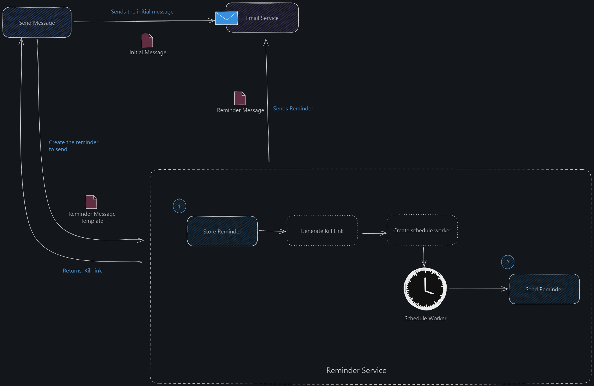
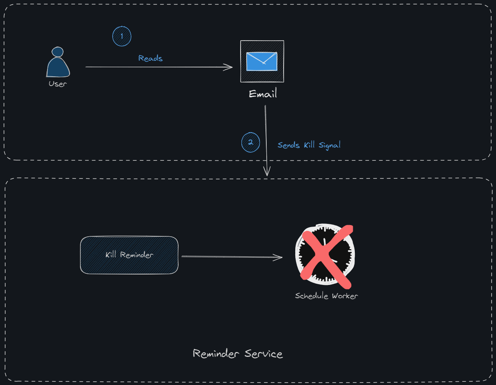

# MyNudgely

MyNudgely is a reminder notification service/module that helps create and trigger reminders to desired audiences to perform certain action. 

The reminder will have a finite number of iterations where the service will then stops from triggering when it has reached the maximum amount. 

The service also will generate a `kill link` that could be use as a mean to track and stop any further reminder triggers. 

## The overview

The overview on how everything works.

## Kill link

Using the `kill link` provided that could be embeded in the email message, the service could be notify on the kill action to stop any further future reminder as the desired action has been fulfilled. 

The `cdk.json` file tells the CDK Toolkit how to execute your app.

## Useful commands

* `npm run build`   compile typescript to js
* `npm run watch`   watch for changes and compile
* `npm run test`    perform the jest unit tests
* `npx cdk deploy`  deploy this stack to your default AWS account/region
* `npx cdk diff`    compare deployed stack with current state
* `npx cdk synth`   emits the synthesized CloudFormation template
